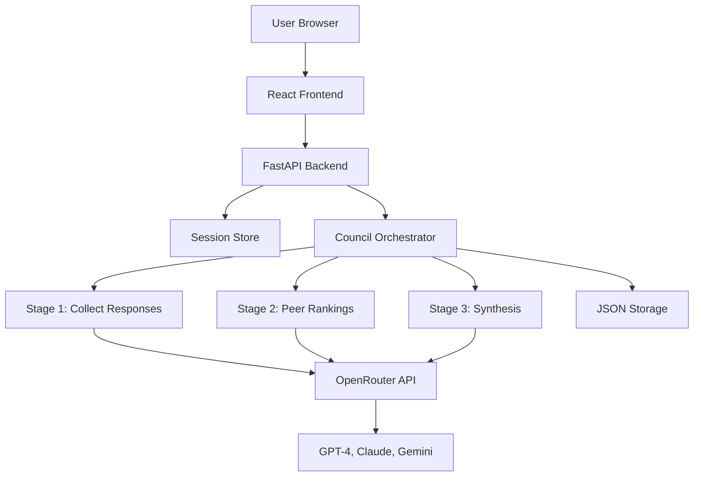

# Design Document

## Overview

Mirmer AI is a multi-LLM consultation system built as a web application with FastAPI backend and React frontend. The system follows the proven **3-Stage Council Process**: (1) collect individual responses from multiple models in parallel, (2) have models peer-review each other's responses anonymously, and (3) synthesize a final answer using a chairman model with full context. The MVP uses session-based authentication with OpenRouter API key and JSON file storage.

## Architecture

### High-Level Architecture



### Technology Stack

**Backend:**
- Python 3.10+ with FastAPI
- httpx for async HTTP requests
- OpenRouter API for unified LLM access
- JSON files for conversation storage
- uv for package management

**Frontend:**
- React 19 with Vite
- Server-Sent Events for real-time streaming
- react-markdown for response rendering
- Tailwind CSS for styling

**Communication:**
- REST API for CRUD operations
- Server-Sent Events (SSE) for progressive updates

## The 3-Stage Council Process

### Stage 1: Individual Responses
- User query sent to all council models simultaneously
- Parallel execution using `asyncio.gather()`
- Each model provides independent response
- Results displayed in tabbed interface

### Stage 2: Peer Review & Ranking
- Responses anonymized as "Response A", "Response B", etc.
- Each model receives all anonymized responses
- Models evaluate and rank responses
- Rankings parsed using regex with fallback strategies
- Aggregate rankings calculated to show "street cred"

### Stage 3: Final Synthesis
- Chairman model receives ALL context:
  - All individual responses from Stage 1
  - All peer rankings from Stage 2
- Chairman synthesizes comprehensive final answer
- Represents collective wisdom of the council

## Components and Interfaces

### Backend Components

#### 1. Configuration (`backend/config.py`)
```python
OPENROUTER_API_KEY = os.getenv("OPENROUTER_API_KEY")

COUNCIL_MODELS = [
    "openai/gpt-4-turbo",
    "anthropic/claude-3-sonnet",
    "google/gemini-pro"
]

CHAIRMAN_MODEL = "anthropic/claude-3-sonnet"

OPENROUTER_API_URL = "https://openrouter.ai/api/v1/chat/completions"
DATA_DIR = "data/conversations"
```

#### 2. OpenRouter Client (`backend/openrouter.py`)
```python
async def query_model(
    model: str,
    messages: List[Dict[str, str]],
    timeout: float = 120.0
) -> Optional[Dict[str, Any]]:
    """Query a single model via OpenRouter API."""
    # Returns {'content': str} or None on failure

async def query_models_parallel(
    models: List[str],
    messages: List[Dict[str, str]]
) -> Dict[str, Optional[Dict[str, Any]]]:
    """Query multiple models in parallel using asyncio.gather()."""
    # Returns {model: response} dictionary
```

#### 3. Council Orchestrator (`backend/council.py`)
```python
async def stage1_collect_responses(user_query: str) -> List[Dict[str, Any]]:
    """Stage 1: Collect individual responses from all council models."""
    # Returns [{"model": str, "response": str}, ...]

async def stage2_collect_rankings(
    user_query: str,
    stage1_results: List[Dict[str, Any]]
) -> Tuple[List[Dict[str, Any]], Dict[str, str]]:
    """Stage 2: Each model ranks anonymized responses."""
    # Returns (rankings, label_to_model_mapping)

def parse_ranking_from_text(ranking_text: str) -> List[str]:
    """Parse FINAL RANKING section using regex with fallbacks."""
    # Returns ["Response C", "Response A", "Response B"]

def calculate_aggregate_rankings(
    stage2_results: List[Dict[str, Any]],
    label_to_model: Dict[str, str]
) -> List[Dict[str, Any]]:
    """Calculate aggregate rankings across all models."""
    # Returns [{"model": str, "average_rank": float, "rankings_count": int}]

async def stage3_synthesize_final(
    user_query: str,
    stage1_results: List[Dict[str, Any]],
    stage2_results: List[Dict[str, Any]]
) -> Dict[str, Any]:
    """Stage 3: Chairman synthesizes final response."""
    # Returns {"model": str, "response": str}
```

#### 4. Storage Layer (`backend/storage.py`)
```python
def create_conversation(conversation_id: str) -> Dict[str, Any]:
    """Create a new conversation JSON file."""

def get_conversation(conversation_id: str) -> Optional[Dict[str, Any]]:
    """Load conversation from JSON file."""

def add_user_message(conversation_id: str, content: str):
    """Add user message to conversation."""

def add_assistant_message(
    conversation_id: str,
    stage1: List[Dict],
    stage2: List[Dict],
    stage3: Dict
):
    """Add complete assistant message with all 3 stages."""

def list_conversations() -> List[Dict[str, Any]]:
    """List all conversations with metadata."""
```

#### 5. FastAPI Endpoints (`backend/main.py`)
```python
@app.post("/api/conversations")
async def create_conversation():
    """Create a new conversation."""

@app.get("/api/conversations")
async def list_conversations():
    """List all conversations."""

@app.get("/api/conversations/{conversation_id}")
async def get_conversation(conversation_id: str):
    """Get specific conversation."""

@app.post("/api/conversations/{conversation_id}/message/stream")
async def send_message_stream(conversation_id: str, request: MessageRequest):
    """Send message and stream 3-stage council process via SSE."""
    # Yields events: stage1_start, stage1_complete, stage2_start, 
    # stage2_complete, stage3_start, stage3_complete, complete
```

### Frontend Components

#### 1. API Client (`frontend/src/api.js`)
```javascript
export const api = {
  async sendMessageStream(conversationId, content, onEvent) {
    // Handles Server-Sent Events streaming
    // Calls onEvent(eventType, eventData) for each event
  },
  
  async createConversation() { },
  async listConversations() { },
  async getConversation(id) { }
};
```

#### 2. Main App (`frontend/src/App.jsx`)
```javascript
// State structure:
{
  conversations: [...],
  currentConversationId: "uuid",
  currentConversation: {
    messages: [
      { role: "user", content: "..." },
      {
        role: "assistant",
        stage1: [{model, response}, ...],
        stage2: [{model, ranking, parsed_ranking}, ...],
        stage3: {model, response},
        metadata: {label_to_model, aggregate_rankings},
        loading: {stage1: false, stage2: false, stage3: false}
      }
    ]
  }
}
```

#### 3. Stage Components
- **Stage1.jsx**: Tabbed interface for individual responses
- **Stage2.jsx**: Rankings display with aggregate leaderboard
- **Stage3.jsx**: Final chairman answer
- **Sidebar.jsx**: Conversation list
- **ChatInterface.jsx**: Message input and display

## Data Models

### Conversation Object
```json
{
  "id": "uuid",
  "created_at": "2025-11-30T...",
  "title": "Generated from first query",
  "messages": [
    {
      "role": "user",
      "content": "What is quantum entanglement?"
    },
    {
      "role": "assistant",
      "stage1": [
        {"model": "openai/gpt-4-turbo", "response": "..."}
      ],
      "stage2": [
        {
          "model": "openai/gpt-4-turbo",
          "ranking": "Full evaluation text...\n\nFINAL RANKING:\n1. Response C\n2. Response A",
          "parsed_ranking": ["Response C", "Response A", "Response B"]
        }
      ],
      "stage3": {
        "model": "anthropic/claude-3-sonnet",
        "response": "Based on the council's deliberation..."
      }
    }
  ]
}
```

### OpenRouter API Format

**Request:**
```json
{
  "model": "openai/gpt-4-turbo",
  "messages": [
    {"role": "user", "content": "query"}
  ]
}
```

**Headers:**
```json
{
  "Authorization": "Bearer sk-or-v1-...",
  "Content-Type": "application/json"
}
```

**Response:**
```json
{
  "choices": [
    {
      "message": {
        "content": "response text"
      }
    }
  ]
}
```

## Key Design Patterns

### 1. Parallel Execution
```python
# All queries within a stage run concurrently
tasks = [query_model(model, messages) for model in COUNCIL_MODELS]
responses = await asyncio.gather(*tasks)
```

### 2. Anonymization
```python
# Stage 2: Prevent bias in peer review
labels = [chr(65 + i) for i in range(len(responses))]  # A, B, C...
label_to_model = {f"Response {l}": r['model'] for l, r in zip(labels, responses)}
```

### 3. Server-Sent Events
```python
# Backend: Stream progressive updates
async def event_generator():
    yield f"data: {json.dumps({'type': 'stage1_start'})}\n\n"
    stage1 = await stage1_collect_responses(query)
    yield f"data: {json.dumps({'type': 'stage1_complete', 'data': stage1})}\n\n"
```

```javascript
// Frontend: Handle streaming events
const reader = response.body.getReader();
while (true) {
  const {done, value} = await reader.read();
  if (done) break;
  // Parse and handle events
}
```

### 4. Optimistic UI Updates
```javascript
// Immediately show user message
setMessages([...messages, userMessage]);

// Add placeholder for assistant message
setMessages([...messages, userMessage, emptyAssistantMessage]);

// Fill in progressively as events arrive
onEvent('stage1_complete', (data) => {
  updateLastMessage({stage1: data});
});
```

## Stage 2 Ranking Prompt

```python
ranking_prompt = f"""You are evaluating different responses to: {user_query}

Here are the responses (anonymized):

Response A:
{response_a_text}

Response B:
{response_b_text}

Response C:
{response_c_text}

Your task:
1. Evaluate each response individually
2. Provide a final ranking

IMPORTANT: Format your ranking EXACTLY as:

FINAL RANKING:
1. Response X
2. Response Y
3. Response Z

Now provide your evaluation and ranking:"""
```

## Stage 3 Chairman Prompt

```python
chairman_prompt = f"""You are the Chairman of an LLM Council. Multiple AI models have provided responses and ranked each other.

Original Question: {user_query}

STAGE 1 - Individual Responses:
{all_responses_formatted}

STAGE 2 - Peer Rankings:
{all_rankings_formatted}

Your task: Synthesize all of this into a single, comprehensive answer. Consider:
- Individual responses and their insights
- Peer rankings and what they reveal
- Patterns of agreement or disagreement

Provide a clear, well-reasoned final answer:"""
```

## Error Handling

### Error Types
1. **Model Query Failures**: Log and continue with remaining models
2. **Complete Stage Failure**: All models fail - show error to user
3. **Parsing Failures**: Use fallback regex strategies
4. **Timeout Errors**: 120s timeout per model request
5. **Network Errors**: Retry logic with exponential backoff

### Error Events (SSE)
```json
{"type": "error", "message": "Error description"}
```

## Performance Optimization

### Parallel Execution
- Stage 1: All models queried simultaneously (~15-30s)
- Stage 2: All rankings collected simultaneously (~20-40s)
- Stage 3: Single chairman query (~10-20s)
- **Total: 45-90 seconds** (vs 180+ seconds sequential)

### Title Generation
```python
# Run in parallel with stages (don't block)
title_task = asyncio.create_task(generate_title(query))
# ... run stages ...
title = await title_task  # Probably already done
```

## Security Considerations

1. **API Key Storage**: Server-side session only, never in client code
2. **Session Security**: httpOnly cookies, 30-minute timeout
3. **Input Validation**: Sanitize queries, validate length (10-2000 chars)
4. **Rate Limiting**: Per-session limits to prevent abuse
5. **CORS**: Restrict origins in production

## Testing Strategy

### Unit Tests
- Test `parse_ranking_from_text()` with various formats
- Test `calculate_aggregate_rankings()` with sample data
- Test OpenRouter client error handling

### Integration Tests
- Test complete 3-stage flow with mocked OpenRouter
- Test SSE streaming
- Test conversation storage

### Manual Testing
- Test with real OpenRouter API key
- Verify all three stages display correctly
- Test error scenarios (invalid key, network failures)

## Future Enhancements

1. **Streaming Individual Responses**: Stream Stage 1 responses as they arrive
2. **Custom Council Configurations**: Save/load different model sets
3. **Debate History Analytics**: Track model performance over time
4. **Export Functionality**: Download conversations as PDF/Markdown
5. **Multi-turn Conversations**: Follow-up questions with context
6. **Model Cost Tracking**: Show estimated API costs per query

